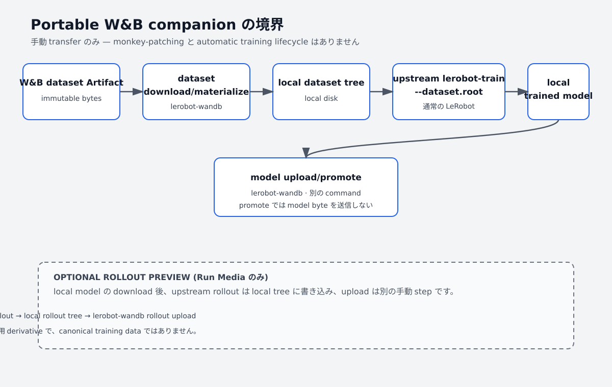
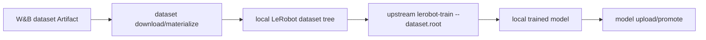

# LeRobot 用 W&B companion マニュアル（SO-101 の例）



[English manual](./MANUAL.md) · [プロジェクト README](./README.md)

このマニュアルは、通常の upstream LeRobot をすでに導入していて、LeRobot の dataset、model、
rollout 結果を W&B Artifact で扱いたい利用者を対象にしています。`lerobot-wandb` は LeRobot 用の
W&B companion integration で、既存の upstream LeRobot と同じ environment で動きます。upstream
LeRobot はこの integration 用の generic plugin contract を現在公開していないため、native plugin
ではなく companion CLI として動作します。LeRobot を patch、置換したり、LeRobot の namespace に
file を追加したりしません。

この例で使用する companion の version は `0.1.0`、対応する LeRobot の範囲は
`>=0.6.1,<0.6.2` です。まだ PyPI release はありません。現在利用できる経路は以下の
source-install command です。将来の first release 後には `pip install lerobot-wandb` に短縮
できますが、その command が今すぐ動くとは限りません。

図は概念図です。以下の command と境界が companion interface の説明です。このドキュメント
変更では W&B workspace や実機に対する live 検証は行っていません。自分の entity、project、
hardware port、camera 設定、success 数を指定してください。

## LeRobot × W&B integration の全体像（ecosystem context）

<details>
<summary>ecosystem overview を表示（背景情報のみ）</summary>


この image は upstream showcase 由来の、LeRobot × W&B integration の全体像です。背景情報であり、
`lerobot-wandb` の完全な capability contract ではありません。Auto-Upload/Streaming、
training-run recording、deployment/closed-loop、all-data/paid-plan などの表示・主張は、
upstream の optional 設定、historical fork hooks、external deployment に依存する場合があります。
これらを `lerobot-wandb` 単独では保証しません。

</details>

companion の command flow として保証されるのは次の経路です。W&B dataset Artifact →
`lerobot-wandb dataset download/materialize` → local LeRobot dataset tree → upstream
`lerobot-train --dataset.root=...` → local model → `lerobot-wandb model upload/promote`。

## 最短の companion workflow

companion の構成では upstream の training process をそのまま使います。



最短の working route は次のとおりです。

```bash
pip install "lerobot-wandb @ git+https://github.com/guchengwei/lerobot-wandb.git"
wandb login

lerobot-wandb dataset download \
  --ref my-team/so101-pick-cube/pick-cube:raw \
  --root ./datasets/pick-cube

lerobot-train \
  --dataset.repo_id=local/pick-cube \
  --dataset.root=./datasets/pick-cube \
  --policy.type=act \
  --policy.device=cuda \
  --output_dir=./outputs/train/act_pick_cube \
  --steps=100000 \
  --policy.push_to_hub=false

lerobot-wandb model upload \
  --root ./outputs/train/act_pick_cube/checkpoints/last/pretrained_model \
  --entity my-team --project so101-pick-cube \
  --name pick-cube-policy --alias candidate

lerobot-wandb model promote \
  --ref my-team/so101-pick-cube/pick-cube-policy:v0 \
  --alias production --registry-collection pick-cube-policy
```

`my-team`、project、Artifact 名、local `repo_id` label（必要なら）、policy 設定、resolved model version は自分の値へ置き換えて
ください。model path は `output_dir` の下に upstream LeRobot が作成した checkpoint です。
選択した policy と training configuration の実際の場所を確認してください。`model promote` には、
後から動く alias ではなく、評価に使用した immutable version を指定します。

## Companion の境界

この repository が担当するのは Artifact の transfer と inspection であり、upstream の training
lifecycle ではありません。具体的には次のとおりです。

- dataset を local LeRobot tree に download してから、upstream `lerobot-train` を実行します。
- local model の upload と promote は、companion の別 command で行います。
- `lerobot-record`、`lerobot-train`、`lerobot-rollout` と upstream 側の optional な W&B logging は
  upstream LeRobot が管理します。companion がこれらの lifecycle を自動的に引き取り、同じ training
  Run で final model を publish することはありません。
- historical fork の train-time Artifact option と W&B 固有の final-model fields は companion
  interface に含まれません。upstream `lerobot-train` に fork 専用 option を追加しないでください。
- import-time patch、wrapper の置換、LeRobot fork への隠れた依存はありません。

### Actual companion contract

| Surface | Companion contract |
| --- | --- |
| W&B-backed remote lifecycle | requested ref を解決し、immutable lineage と transfer metadata を記録します。 |
| materialized dataset/model | upload 前に local dataset/model directory を検証します。Artifact の download 完了後、local disk 上の内容が materialized となり、network なしで読み取れます。 |
| Artifact transfer | canonical dataset、model、rollout の Artifact byte を upload / download します。 |
| dataset review preview | inspection 用に bounded な Run Media を公開します。canonical dataset byte の代わりにはなりません。 |
| rollout Artifact | 評価した model を lineage input として宣言した、別個の rollout Artifact を upload します。 |
| Registry collection / Promotion | 評価済み self-contained model を Registry collection に link し、指定した immutable version を promote します。 |

これらは upstream LeRobot の周囲で明示的に実行する companion command です。training hook、
streaming recorder、deployment controller、同じ Run での model publication を自動化する lifecycle
ではありません。

ここでの「materialized」には明確な意味があります。upload 前は、local dataset/model directory を
Artifact の source として検証します。対応する Artifact の download が完了し、期待される file が
local disk に揃った後の内容を materialized dataset/model と呼びます。upstream はその local tree
を直接読み、read path で W&B network に接続する必要はありません。

companion は既存の upstream LeRobot と同じ environment で動き、LeRobot を runtime companion として
利用します。base distribution は resolver が既存の LeRobot を置き換えないよう hard dependency に
していません。LeRobot dataset や video を inspection する command は、実行時に導入済み version を
確認します。未導入または非対応の場合は actionable error を表示します。global な
`--allow-unsupported-lerobot` は experimental な escape hatch であり、互換性を保証するものでは
ありません。

日本語 document はこの manual の翻訳 mirror です。別の product、command、compatibility range を
追加するものではありません。

## 0. Install と prerequisites

通常の upstream LeRobot が入っている environment に companion を導入します。first PyPI release
までは repository が installable source です。

```bash
pip install "lerobot-wandb @ git+https://github.com/guchengwei/lerobot-wandb.git"
wandb login
export WANDB_ENTITY="your-wandb-entity"
export WANDB_PROJECT="so101-pick-cube"
lerobot-wandb --help
```

LeRobot がまだない fresh environment では、同じ source checkout から tested extra を要求できます。

```bash
pip install "lerobot-wandb[lerobot] @ git+https://github.com/guchengwei/lerobot-wandb.git"
```

base install は既存の LeRobot を意図的にそのまま残します。upstream LeRobot の document に従って
install と設定を行い、開始前に対応 range に入っていることを確認してください。companion の
upload、download、promotion command には W&B network access と credentials が必要です。recording
と rollout command には、適切な robot、teleoperator、camera、video dependency も必要です。

実行例は Linux と Bash-compatible shell を前提にしています。PowerShell では
`.venv\Scripts\Activate.ps1` で environment を有効化し、`/dev/ttyACM*` を対応する `COM` port に
置き換えてください。CLI argument 名は変わりません。

W&B は完成した Artifact を保存する durable store であり、robot が直接アクセスする filesystem
ではありません。local disk は recording buffer、materialization 先、rollout input として残ります。
robot の control loop 内で W&B call を行う必要はありません。

## 1. Local teaching dataset を記録する

これは upstream LeRobot の通常の recording です。この時点では W&B は関与しません。robot type、
port、camera、task、episode 数を環境に合わせて調整してください。

```bash
lerobot-record \
  --robot.type=so101_follower --robot.port=/dev/ttyACM0 --robot.id=my_follower \
  --teleop.type=so101_leader --teleop.port=/dev/ttyACM1 --teleop.id=my_leader \
  --robot.cameras="{ front: {type: opencv, index_or_path: 0, width: 640, height: 480, fps: 30}}" \
  --dataset.repo_id=local/pick-cube \
  --dataset.root=./data/pick-cube \
  --dataset.single_task="Pick up the cube and place it in the bin" \
  --dataset.num_episodes=30 \
  --dataset.push_to_hub=false
```

local の `repo_id` は LeRobot が使う label で、`root` は validation して upload する directory
です。root は temporary preview directory の外側に置いてください。

## 2. Dataset Artifact と review media を upload する

upload 前に local dataset directory を検証し、その tree を companion で publish します。

```bash
lerobot-wandb dataset upload \
  --root ./data/pick-cube \
  --entity "$WANDB_ENTITY" \
  --project "$WANDB_PROJECT" \
  --name pick-cube \
  --alias raw
```

この command は W&B Run を作成する前に metadata、schema、Parquet file、index、参照 video を検証
します。例えば `your-wandb-entity/so101-pick-cube/pick-cube:v0` のような immutable resolved
reference が表示されるので、再現性が必要な場合は保存してください。

dataset の byte は canonical Artifact file として残ります。video があれば、既定の deterministic
representative preview は browser-playable な Run Media item として別に記録されます。特定 episode
には `--preview-episode` を繰り返し、全 episode と camera には `--preview-all` を使います。全件
review は既定で 50 episode が上限で、`--preview-max-episodes` で明示的に増やせます。review media
が不要、または H.264 encoder がない場合は `--no-preview` を使ってください。preview media は
inspection 専用であり、training data として扱わないでください。

current v3 dataset layout に対応しています。canonical v2.1 dataset は transfer と materialize が
できますが、ここでは transfer-only であり、rollout evaluation の publish には利用できません。

## 3. Dataset を download して local に materialize する

training 前に dataset の immutable または named version を local tree へ download します。

```bash
lerobot-wandb dataset download \
  --ref "$WANDB_ENTITY/$WANDB_PROJECT/pick-cube:raw" \
  --root ./datasets/pick-cube
```

companion は lineage Run を作り、指定 reference を解決し、download tree を validation して、
`./datasets/pick-cube` に file を配置します。alias を使った場合は、表示された resolved `vN`
reference を記録してください。後から alias が別 version を指すことがあります。

Artifact の download が完了すると、`./datasets/pick-cube` の file は local disk 上の materialized
dataset です。upstream LeRobot はこの tree を読み、read path で W&B network に接続する必要は
ありません。

## 4. Local tree を使って upstream LeRobot で training する

通常の upstream `lerobot-train` を実行します。明示的な local root が companion と LeRobot の
seam です。

```bash
lerobot-train \
  --dataset.repo_id=local/pick-cube \
  --dataset.root=./datasets/pick-cube \
  --policy.type=act \
  --policy.device=cuda \
  --output_dir=./outputs/train/act_pick_cube \
  --job_name=act_pick_cube \
  --batch_size=8 \
  --steps=100000 \
  --policy.push_to_hub=false
```

この training command は upstream LeRobot の control 下で実行され、companion の W&B transfer command
とは別の step です。materialize した LeRobot tree を読み、local checkpoint を保存します。upstream
LeRobot 側で optional な W&B logging を有効にする場合も、この境界は変わりません。上の
`output_dir` では final policy は通常
`./outputs/train/act_pick_cube/checkpoints/last/pretrained_model` の下に作られますが、policy と
training configuration によって異なるため log と checkpoint layout を確認してください。companion
は path を推測・書き換えません。

resume する場合は output directory だけでなく、保存された upstream training configuration を使います。

```bash
lerobot-train --resume=true \
  --config_path=./outputs/train/act_pick_cube/checkpoints/last/pretrained_model/train_config.json
```

policy や upstream release により checkpoint layout が異なる場合は、確認済みの local directory を
次の `model upload` に渡してください。PEFT/LoRA の adapter-only directory は storage 用に upload
できますが、self-contained な deployable policy ではありません。rollout と Registry には merged
checkpoint を publish してください。

## 5. Trained model を upload / fetch する

upload 前に local model directory を versioned model Artifact の source として検証します。構造検証は
expected config file と weight file の存在を確認しますが、weight を load/execute しません。rollout
前に model-specific validation を実施してください。

```bash
lerobot-wandb model upload \
  --root ./outputs/train/act_pick_cube/checkpoints/last/pretrained_model \
  --entity "$WANDB_ENTITY" \
  --project "$WANDB_PROJECT" \
  --name pick-cube-policy \
  --alias candidate
```

companion は upload Run を作る前に model manifest を検証します。これは構造検証だけであり、expected
config file と weight file を確認しますが、weight を load/execute しません。任意で
`--registry-collection pick-cube-policy` を付けると、self-contained model を unified W&B Registry
へ link できます。adapter-only、または deploy できない directory は upload できますが、deployable
Registry link は拒否されます。

robot を動かす machine では、candidate を local policy directory へ download します。

```bash
lerobot-wandb model download \
  --ref "$WANDB_ENTITY/$WANDB_PROJECT/pick-cube-policy:candidate" \
  --root ./policies/pick-cube-candidate
```

command が表示する full immutable reference を `MODEL_REF` に保存します。rollout の lineage を記録
する際に mutable alias へ置き換えないでください。

```bash
export MODEL_REF="your-wandb-entity/so101-pick-cube/pick-cube-policy:v0"
```

生成された directory は local の upstream policy path です。Artifact の download が完了すると、
その内容は local disk 上の materialized model となり、read path で W&B network に接続する必要は
ありません。download は transactional に行われ、expected config file と weight file の存在を再度
構造検証しますが、weight を load/execute しません。rollout 前に model-specific validation を実施
してください。

## 6. Robot で rollout し結果を publish する

download した local policy を使い、upstream の通常の rollout command を実行します。`rollout_`
prefix は upstream が local evaluation dataset に使う convention です。

```bash
lerobot-rollout \
  --strategy.type=episodic \
  --policy.path=./policies/pick-cube-candidate \
  --robot.type=so101_follower --robot.port=/dev/ttyACM0 --robot.id=my_follower \
  --teleop.type=so101_leader --teleop.port=/dev/ttyACM1 --teleop.id=my_leader \
  --dataset.repo_id=local/rollout_pick-cube \
  --dataset.root=./data/rollout-pick-cube \
  --dataset.num_episodes=20 \
  --dataset.single_task="Pick up the cube and place it in the bin" \
  --dataset.push_to_hub=false
```

rollout 中に成功した episode 数を数えます。結果を publish する前に robot を切り離してください。
upload は別の W&B 操作です。

```bash
export EPISODES_SUCCEEDED="14"

lerobot-wandb rollout upload \
  --root ./data/rollout-pick-cube \
  --entity "$WANDB_ENTITY" \
  --project "$WANDB_PROJECT" \
  --name pick-cube-rollout \
  --model-ref "$MODEL_REF" \
  --episodes-succeeded "$EPISODES_SUCCEEDED"
```

success 数は operator が入力し、companion が physical task の success を判定することはありません。
rollout publish は current v3 layout に対応しています。model は lineage のため input として宣言
されますが、再度 download はしません。rollout は別個の `rollout` Artifact となり、canonical
video byte は変更されません。video がある場合は browser playback 用の deterministic H.264/yuv420p
derivative を Run Media に記録しますが、Artifact の一部ではなく training data でもありません。

`candidate` ではなく immutable な `MODEL_REF` を使ってください。alias が動くと、robot が使用して
いない model と結果が関連付けられる可能性があります。

## 7. 評価した version を promote する

promotion は alias と、任意で Registry link を変更します。model byte の upload は行いません。

```bash
lerobot-wandb model promote \
  --ref "$MODEL_REF" \
  --alias production \
  --registry-collection pick-cube-policy
```

rollout で評価した exact version を promote します。download 済み directory を再 upload すると、
evaluation の lineage edge がない新しい version が作られます。model ではない Artifact は拒否され、
self-contained policy でない model は deployable Registry link を受けられません。production の判断は
自動化されないため、rollout Run を確認して operator が決めます。

## 完了後の保存先

| Object | Local または W&B の場所 |
| --- | --- |
| Teaching dataset | `dataset` Artifact collection `pick-cube` |
| Materialized training input | `./datasets/pick-cube` |
| Trained policy | local checkpoint、続いて `model` Artifact `pick-cube-policy` |
| Rollout episodes | local rollout tree、続いて `rollout` Artifact `pick-cube-rollout` |
| Dataset-to-policy trace | 選択した Artifact ref と local training configuration |
| Policy-to-rollout trace | rollout Run input edge と rollout Artifact metadata |

この workflow の目的は再現可能な handoff です。canonical dataset byte を local に materialize し、
upstream LeRobot がその tree から training し、別に upload した model と rollout が評価・promotion
の根拠となる immutable reference を保持します。

## Troubleshooting と検証範囲

- `lerobot-wandb --help`、各 subcommand の `--help`、source の `pyproject.toml` がこの release の
  authoritative CLI surface です。
- runtime compatibility error が出た場合は、ordinary upstream LeRobot `0.6.1` を導入するか、独自に
  compatibility を確認した場合だけ documented experimental override を使ってください。
- preview encoding が利用できない場合、dataset upload に `--no-preview` を指定してください。
  canonical Artifact file には影響しません。
- upload、download、promotion には online W&B credentials が必要です。この manual は live workspace、
  robot、physical success result が検証済みだとは主張しません。
- PyPI registration、trusted-publisher binding、first release は future work です。project が release
  を告知するまでは Git source-install route を使ってください。
