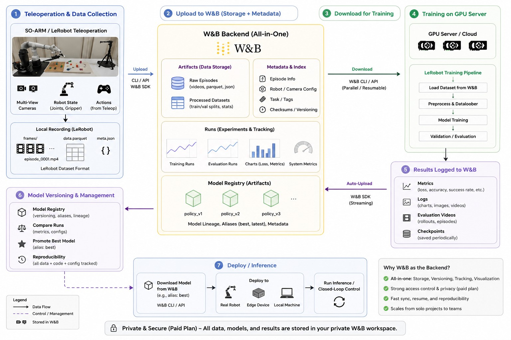

# lerobot-wandb

[日本語](./README.ja.md)

Move LeRobot datasets, trained policies, and rollout results through Weights & Biases Artifacts without replacing or patching upstream [LeRobot](https://github.com/huggingface/lerobot).



The diagram shows the full LeRobot and W&B workflow. `lerobot-wandb` handles the Artifact steps around recording, training, and rollout; the robot-facing commands remain standard LeRobot commands.

## What this package does

`lerobot-wandb` is a companion CLI for an existing LeRobot installation. It gives local LeRobot directories a versioned W&B lifecycle:

- upload and download datasets, models, and rollout datasets as W&B Artifacts;
- validate local directories before upload and after download;
- create browser-playable dataset and rollout previews without changing the canonical video files;
- record requested and resolved Artifact references for reproducibility;
- connect rollout results to the exact model version that produced them; and
- promote an evaluated model version with an alias or a W&B Registry link.

It is a separate distribution, not a native LeRobot plugin:

- distribution: `lerobot-wandb`
- Python package: `lerobot_wandb`
- command: `lerobot-wandb`

## How it fits with LeRobot

| Step | Command | Owner |
| --- | --- | --- |
| Record demonstrations | `lerobot-record` | upstream LeRobot |
| Upload or download a dataset | `lerobot-wandb dataset ...` | this companion |
| Train a policy | `lerobot-train` | upstream LeRobot |
| Upload, download, or promote a policy | `lerobot-wandb model ...` | this companion |
| Run a policy on the robot | `lerobot-rollout` | upstream LeRobot |
| Publish rollout results | `lerobot-wandb rollout upload` | this companion |

The handoff is always a local directory. W&B stores finished Artifacts; it is not part of the robot control loop.

## Requirements

- Python 3.12 or later
- a W&B account and network access for Artifact operations
- upstream LeRobot `>=0.6.1,<0.6.2` for commands that inspect LeRobot datasets or videos
- the normal robot, camera, and video dependencies required by your LeRobot setup

The current package version is `0.1.0`. It has not been published to PyPI yet, so install it from GitHub.

## Install

Install `lerobot-wandb` into the **same Python environment as LeRobot**. LeRobot-dependent companion commands import LeRobot from the active environment.

For example, if your LeRobot checkout uses `.venv`:

```bash
source /path/to/lerobot/.venv/bin/activate
uv pip install "lerobot-wandb @ git+https://github.com/guchengwei/lerobot-wandb.git"
wandb login
lerobot-wandb --help
```

For a fresh setup, use LeRobot's `uv` environment pattern and install both packages into one `.venv`:

```bash
mkdir lerobot-workspace
cd lerobot-workspace

uv python install 3.12
uv venv --python 3.12
source .venv/bin/activate

uv pip install "lerobot[core_scripts,training,feetech]==0.6.1"
uv pip install "lerobot-wandb @ git+https://github.com/guchengwei/lerobot-wandb.git"

wandb login
lerobot-info
lerobot-wandb --help
```

`feetech` supplies the motor dependencies for the SO-101 example below. Replace it with the extra required by your robot. Follow the upstream [LeRobot installation guide](https://huggingface.co/docs/lerobot/installation) for system packages such as FFmpeg and for platform-specific PyTorch instructions.

The base package does not declare LeRobot as a hard dependency. This avoids replacing an existing upstream installation during dependency resolution. At runtime, LeRobot-dependent commands check the installed version and explain how to proceed when it is missing or unsupported. `--allow-unsupported-lerobot` is available for experiments, but it is not a compatibility guarantee.

## Uninstall

Activate the same LeRobot environment and remove the companion with the package manager used for installation:

```bash
source /path/to/lerobot/.venv/bin/activate
uv pip uninstall lerobot-wandb
```

This removes only the `lerobot-wandb` distribution, the `lerobot_wandb` import package, and the `lerobot-wandb` console command. LeRobot remains installed and is not modified. Shared dependencies such as `wandb`, `datasets`, and `pandas` are not automatically removed.

Uninstalling the companion does not delete local datasets, downloaded or materialized Artifacts, models, rollout directories, training outputs, sidecar metadata, or other user data. It also does not delete remote W&B Artifacts, Runs, or Registry objects, and it does not remove W&B authentication or configuration.

## Configure the workflow examples

Set the W&B object names used by the examples once, then reuse them throughout the workflow:

```bash
export WANDB_ENTITY="your-wandb-entity"
export WANDB_PROJECT="your-wandb-project"
export DATASET_NAME="your-dataset"
export POLICY_NAME="your-policy"
export ROLLOUT_NAME="your-rollout"
export DATASET_ROOT="./data/$DATASET_NAME"
export TRAIN_DATASET_ROOT="./datasets/$DATASET_NAME"
export TRAIN_OUTPUT="./outputs/train/$POLICY_NAME"
export POLICY_ROOT="$TRAIN_OUTPUT/checkpoints/last/pretrained_model"
export DOWNLOADED_POLICY_ROOT="./policies/$POLICY_NAME-candidate"
export ROLLOUT_ROOT="./data/$ROLLOUT_NAME"
```

These are examples, not names required by the companion. Set them once for your project; the commands below reuse them.

The examples use Linux and a Bash-compatible shell. On Windows, activate the same LeRobot environment with the matching PowerShell command and replace `/dev/ttyACM*` with your `COM` ports.

## Quick start: train from a W&B dataset

This is the shortest path when a dataset already exists in W&B:

```bash
lerobot-wandb dataset download \
  --ref "$WANDB_ENTITY/$WANDB_PROJECT/$DATASET_NAME:raw" \
  --root "$TRAIN_DATASET_ROOT"

lerobot-train \
  --dataset.repo_id="local/$DATASET_NAME" \
  --dataset.root="$TRAIN_DATASET_ROOT" \
  --policy.type=act \
  --policy.device=cuda \
  --output_dir="$TRAIN_OUTPUT" \
  --steps=100000 \
  --policy.push_to_hub=false

lerobot-wandb model upload \
  --root "$POLICY_ROOT" \
  --entity "$WANDB_ENTITY" \
  --project "$WANDB_PROJECT" \
  --name "$POLICY_NAME" \
  --alias candidate
```

The checkpoint path depends on the policy and training configuration. Confirm the path in the LeRobot training output before uploading it.

## End-to-end workflow

The Artifact workflow is not specific to SO-101. The robot-facing commands below use SO-101 only as a concrete LeRobot example; for another robot, replace the robot, teleoperator, camera, task, and local path arguments while keeping the companion steps the same.

### 1. Record demonstrations locally

Recording is a standard upstream LeRobot operation. W&B is not involved yet.

```bash
lerobot-record \
  --robot.type=so101_follower --robot.port=/dev/ttyACM0 --robot.id=my_follower \
  --teleop.type=so101_leader --teleop.port=/dev/ttyACM1 --teleop.id=my_leader \
  --robot.cameras="{ front: {type: opencv, index_or_path: 0, width: 640, height: 480, fps: 30}}" \
  --dataset.repo_id="local/$DATASET_NAME" \
  --dataset.root="$DATASET_ROOT" \
  --dataset.single_task="Pick up the cube and place it in the bin" \
  --dataset.num_episodes=30 \
  --dataset.push_to_hub=false
```

`repo_id` is LeRobot's local label. `root` is the directory that the companion will validate and upload.

### 2. Upload the dataset

```bash
lerobot-wandb dataset upload \
  --root "$DATASET_ROOT" \
  --entity "$WANDB_ENTITY" \
  --project "$WANDB_PROJECT" \
  --name "$DATASET_NAME" \
  --alias raw
```

The command validates the dataset before creating the W&B Run, then prints an immutable resolved reference such as:

```text
your-wandb-entity/your-wandb-project/your-dataset:v0
```

Save that `vN` reference when reproducibility matters. An alias such as `raw` can later point to another version.

#### Video previews

Canonical video files stay inside the Artifact unchanged. Preview media is a separate browser-playable derivative for review.

- Default: one deterministic representative episode per camera
- Exact episodes: repeat `--preview-episode INDEX`
- All episodes and cameras: `--preview-all`
- Disable previews: `--no-preview`

The Run logs selected review media once, in a stable `dataset_previews` Table with one row per selected episode-camera pair. Use the `episode`, `camera`, and exact `camera_key` columns to filter and group previews; the numeric `episode` column sorts numerically. For example:

```text
episode = 12
camera = front
camera_key = observation.images.front
```

The CLI refuses every selection above 10,000 episode-camera rows, in both interactive and non-interactive environments. Select fewer explicit `--preview-episode` values or use `--no-preview`.

Preview preparation runs locally before `wandb.init()`, so no W&B Run exists while the files are being made. The CLI prints the batch size immediately, then shows each selected episode and camera as it starts and finishes (for example, `[1/4] episode 12 · observation.images.front`). During a transcode, it shows a percentage when duration is known; otherwise it reports activity or frame progress without inventing a percentage or ETA. After preparation, it prints the total and `Starting W&B upload...`.

The budget formula is unchanged: `min(250 MiB, 20% of the canonical dataset directory bytes)`. After the selected previews are prepared, the CLI compares their measured size with that budget. Preview files are for inspection, not training. If the measured media exceeds the budget, an interactive terminal shows both values and asks for confirmation with `[y/N]` (default **No**). `yes` continues with the already-prepared files; `no`, EOF, or any other response stops before `wandb.init()`.

In a non-interactive or CI environment, an over-budget upload fails before W&B unless you pass `--force-preview-budget`. Under budget, that flag has no effect; over budget, it approves only the measured preview-byte overage and does not bypass the 10,000-row Table limit, dataset/schema validation, episode-selection bounds, encoding failures, temporary-path safety checks, or W&B upload errors. To avoid an overage, reduce the preview selection (for example, choose fewer `--preview-episode` values instead of `--preview-all`) or use `--no-preview`.

Current v3 datasets are supported. Canonical v2.1 datasets can be uploaded, downloaded, and materialized. For v2.1, support is limited to dataset transfer; `rollout upload` requires v3.

### 3. Download and materialize the dataset

```bash
lerobot-wandb dataset download \
  --ref "$WANDB_ENTITY/$WANDB_PROJECT/$DATASET_NAME:raw" \
  --root "$TRAIN_DATASET_ROOT"
```

The command resolves the requested reference, downloads the Artifact transactionally, validates the result, and writes the dataset to `$TRAIN_DATASET_ROOT`. Once the download finishes, LeRobot reads that local tree directly and does not need a W&B connection for training.

If you requested an alias, record the resolved `vN` reference printed by the command.

### 4. Train with upstream LeRobot

```bash
lerobot-train \
  --dataset.repo_id="local/$DATASET_NAME" \
  --dataset.root="$TRAIN_DATASET_ROOT" \
  --policy.type=act \
  --policy.device=cuda \
  --output_dir="$TRAIN_OUTPUT" \
  --job_name="$POLICY_NAME" \
  --batch_size=8 \
  --steps=100000 \
  --policy.push_to_hub=false
```

This is an ordinary LeRobot training run. The companion does not wrap the command or publish its final model automatically.

To resume with the saved training configuration:

```bash
lerobot-train --resume=true \
  --config_path="$POLICY_ROOT/train_config.json"
```

Check the actual checkpoint layout before continuing. Adapter-only PEFT or LoRA directories can be stored as Artifacts, but rollout and Registry use require a self-contained policy, such as a merged checkpoint.

### 5. Upload the trained model

```bash
lerobot-wandb model upload \
  --root "$POLICY_ROOT" \
  --entity "$WANDB_ENTITY" \
  --project "$WANDB_PROJECT" \
  --name "$POLICY_NAME" \
  --alias candidate
```

The pre-upload check verifies the expected configuration and weight files. It does not load or execute the weights, so perform any policy-specific validation separately.

Add `--registry-collection "$POLICY_NAME"` if you also want to link a self-contained model to W&B Registry. A model that is not deployable can still be stored as an Artifact, but it cannot receive a deployable Registry link.

### 6. Download the model and publish a rollout

Download the candidate on the robot machine:

```bash
lerobot-wandb model download \
  --ref "$WANDB_ENTITY/$WANDB_PROJECT/$POLICY_NAME:candidate" \
  --root "$DOWNLOADED_POLICY_ROOT"
```

Copy the immutable reference printed by the command. Use it for rollout lineage instead of the movable `candidate` alias. The exact `vN` value comes from the upload result, so do not assume `v0`:

```bash
export MODEL_REF="paste-the-resolved-vN-reference-here"
```

Run the policy with upstream LeRobot:

```bash
lerobot-rollout \
  --strategy.type=episodic \
  --policy.path="$DOWNLOADED_POLICY_ROOT" \
  --robot.type=so101_follower --robot.port=/dev/ttyACM0 --robot.id=my_follower \
  --teleop.type=so101_leader --teleop.port=/dev/ttyACM1 --teleop.id=my_leader \
  --dataset.repo_id="local/$ROLLOUT_NAME" \
  --dataset.root="$ROLLOUT_ROOT" \
  --dataset.num_episodes=20 \
  --dataset.single_task="Pick up the cube and place it in the bin" \
  --dataset.push_to_hub=false
```

Count successful episodes during the evaluation. After disconnecting the robot, publish the result:

```bash
export EPISODES_SUCCEEDED="14"

lerobot-wandb rollout upload \
  --root "$ROLLOUT_ROOT" \
  --entity "$WANDB_ENTITY" \
  --project "$WANDB_PROJECT" \
  --name "$ROLLOUT_NAME" \
  --model-ref "$MODEL_REF" \
  --episodes-succeeded "$EPISODES_SUCCEEDED"
```

The operator supplies the success count; the companion does not score the physical task. The rollout is stored as a separate `rollout` Artifact and declares the evaluated model as a lineage input. Canonical rollout videos remain unchanged. A deterministic H.264/yuv420p derivative is logged as Run Media for browser playback when video is available.

### 7. Promote the evaluated model

```bash
lerobot-wandb model promote \
  --ref "$MODEL_REF" \
  --alias production \
  --registry-collection "$POLICY_NAME"
```

Promotion moves aliases and optionally adds a Registry link; it does not upload model bytes. Promote the exact version used for evaluation. Re-uploading a downloaded directory would create a new model version without the rollout lineage edge.

## Resulting W&B objects

| Object | Location |
| --- | --- |
| Teaching data | `dataset` Artifact collection `$DATASET_NAME` |
| Training input | materialized local directory `$TRAIN_DATASET_ROOT` |
| Trained policy | local checkpoint, then `model` Artifact `$POLICY_NAME` |
| Evaluation episodes | local rollout tree, then `rollout` Artifact `$ROLLOUT_NAME` |
| Dataset-to-policy trace | selected dataset reference plus the local training configuration |
| Policy-to-rollout trace | rollout Run input edge and rollout Artifact metadata |

## What this companion does not do

The historical LeRobot fork included W&B behavior inside training. This repository intentionally does not reproduce those hooks. It does not:

- accept a W&B Artifact reference directly inside `lerobot-train`;
- materialize a dataset from within the training command;
- publish the final model on the same training Run;
- replace upstream `lerobot-record`, `lerobot-train`, or `lerobot-rollout`;
- monkey-patch LeRobot or install files into the `lerobot` package; or
- act as a streaming recorder or deployment controller.

Keeping these boundaries explicit lets the companion run beside an ordinary upstream LeRobot installation.

## Troubleshooting

- **LeRobot is missing or unsupported:** make sure you activated the same Python environment that contains LeRobot, then confirm upstream LeRobot `0.6.1` is installed there. Use `--allow-unsupported-lerobot` only after checking compatibility for your environment.
- **`lerobot-wandb` and `lerobot-*` resolve from different environments:** reactivate the LeRobot virtual environment and install the companion there with `uv pip install`. Keeping both commands in one environment is required for LeRobot-dependent operations.
- **Preview encoding is unavailable:** add `--no-preview` to dataset upload. Canonical Artifact files are unaffected.
- **Preview media exceeds the budget:** the prompt defaults to No; answer `yes` to continue with the prepared files. In CI or another non-interactive environment, reduce the selection, use `--no-preview`, or rerun with `--force-preview-budget`; that flag permits only the measured byte overage and leaves the other safeguards in place.
- **A downloaded alias changed:** use the resolved immutable `vN` reference printed by the command for training records, rollout lineage, and promotion.
- **A model cannot be linked to Registry:** confirm that the directory contains a complete deployable policy rather than only an adapter.
- **A command or option differs from this page:** use `lerobot-wandb --help`, the subcommand's `--help`, and `pyproject.toml` as the command reference for this release.

## Development

From the repository root:

```bash
uv venv --python 3.12 .venv
uv pip install --python .venv/bin/python -e '.[test]'
.venv/bin/python -m pytest -q
```

LeRobot-dependent tests are skipped when LeRobot is absent. The compatibility CI installs supported upstream releases before running those tests. Build checks also confirm that the wheel owns only `lerobot_wandb/*` and the `lerobot-wandb` console entry point.

## Migration history

This repository is a clean snapshot of the companion Artifact-transfer surface from [guchengwei/lerobot](https://github.com/guchengwei/lerobot), source commit `ebdc227057056e077f90fa10155fd505fa53989d`, created for [issue #46](https://github.com/guchengwei/lerobot/issues/46). See [MIGRATION.md](./MIGRATION.md) for the source boundary and the fork-specific hooks that were left behind.
